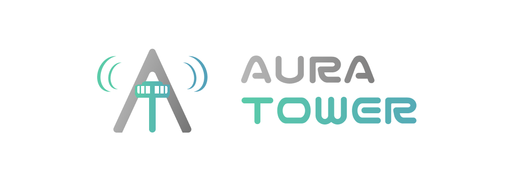
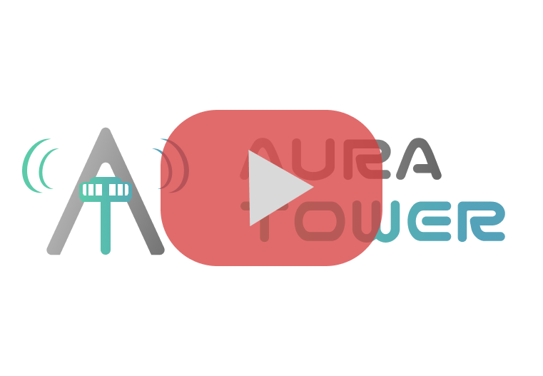

[](https://opensource.org/licenses/MIT) </br>


 </br>


# 🛫 Aura Tower



Aura Tower is an open-source project designed to control and monitor IoT devices through an intuitive dashboard. The
project is highly extensible, allowing users to enhance its functionality with custom device drivers. This README
provides an overview of the project, milestones, and guidelines on how to contribute.

## 📖 Table of Contents

- [📢 Introduction](#-introduction)
- [✨ Features](#-features)
- [🎯 Milestones](#-milestones)
- [💿 Installation](#-installation)
- [😎 Usage](#-usage)
- [🛠️ Contributing](#-contributing)
- [🎖️ License](#-license)

## 📢 Introduction

Aura Tower aims to simplify the management of IoT devices, providing a centralized platform for controlling and
monitoring various devices. The project is built with flexibility in mind, enabling developers to create custom drivers
and expand the system's capabilities.

[](https://www.youtube.com/watch?v=vA4TfWpt0PY "Aura Tower Trailer")

## ✨ Features

- **Dashboard for IoT device management**
- **User authentication system**
- **Places management**
- **Device metrics presentation**
- **Custom device drivers development**

## 🎯 Milestones

1. ~~**User Authentication**~~
    - ~~Register user~~
    - ~~Login~~
    - ~~Remind password~~
    - ~~Refresh token~~
    - ~~Authentication with access token~~
    - ~~Views implementation~~

2. ~~**Places Management**~~
    - ~~Create place~~
    - ~~Delete place~~
    - ~~Update place~~
    - ~~View implementation~~

3. ~~**Metrics Presentation**~~
    - ~~Querying~~
    - ~~WebSockets~~
    - ~~View implementation~~

4. ~~**Application Introduction**~~
    - ~~Views implementation~~

5. ~~**Application Settings**~~
    - ~~Account security settings~~
    - ~~Color scheme modes selection~~
    - ~~Development information~~

6. ~~**Device Simulators**~~
    - ~~Light bulb simulator over HTTP~~
    - ~~Thermometer simulator over HTTP~~

7. **Device Metrics View Creator**
    - Driver, device, type to use
    - Selection of data to display

8. **Areas Inside Places**
    - Grouping devices together for bulk management

9. **Application Optimizations and Technical Debt Pay down**
    - Performance improvements
    - Codebase refactoring

## 💿 Installation

1. Clone the repository:
    ```bash
    git clone https://github.com/blumek/aura-tower.git
    ```

2. Navigate to the project directory:
    ```bash
    cd aura-tower
    ```

3. Install the necessary dependencies:
   <br />If using Windows:
    ```bash
   .\backend\mvnw.cmd clean install
   ```
   <br />If using Linux/Mac:
   ```bash
   ./backend/mvnw clean install
   ```

4. Pull docker containers:
    ```bash
    docker compose pull
    ```

5. Build docker containers:
    ```bash
    docker compose build
    ```

6. Start docker containers:
    ```bash
    docker compose up -d
    ```

## 😎 Usage

After starting the development server, open your browser and navigate to `http://localhost:4201`. From the dashboard,
you can register a new account, log in, and start managing your IoT devices. Use the settings to customize your
experience and explore the various features offered by Aura Tower.

## 🛠️ Contributing

Aura Tower is open to contributions from the community. To contribute:

1. Fork the repository on GitHub.
2. Create a new branch for your feature or bugfix.
3. Make your changes and commit them with descriptive messages.
4. Push your changes to your forked repository.
5. Open a pull request on the main repository.

Please ensure your code adheres to the project's coding standards and includes appropriate tests.

## 🎖️ License

Aura Tower is open-source software licensed under the [MIT License](https://opensource.org/licenses/MIT). You are free to use, modify, and
distribute this software as long as you comply with the license terms.

---

Thank you for being a part of the Aura Tower community! Together, we can build a powerful and flexible platform for IoT
device management.
